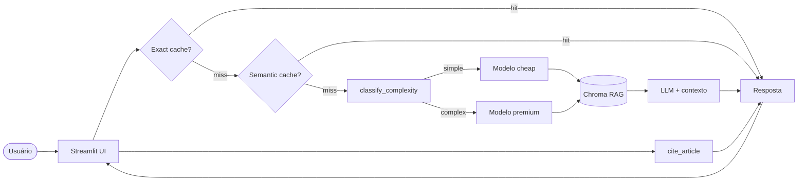

# Assistente LGPD com RAG

> **Assistente informacional de compliance LGPD** que responde perguntas de desenvolvedores e gestores com base em corpus local (Lei 13.709/2018), citando fontes e reduzindo custo com cache e model routing.

**Live demo:** _a publicar — Streamlit Cloud_

**GitHub:** _a publicar_

**Vídeo demo (≤3 min):** _a publicar_

---

## Problem statement

1. **Problema:** times de produto e engenharia precisam consultar rapidamente requisitos da LGPD (CPF, consentimento, retenção, base legal) sem vasculhar PDFs longos ou depender de interpretações não fundamentadas.
2. **Público-alvo:** desenvolvedores, analistas de produto, gestores de TI e estudantes de privacidade de dados.
3. **Por que LLM + RAG + tool-use:** busca por palavra-chave falha em perguntas naturais; RAG ancora respostas no corpus; a tool `cite_article` permite consulta determinística de artigos específicos sem alucinação.

## Arquitetura



## Setup local

```bash
# 1. Clone
git clone <seu-repo>
cd assistente-lgpd-rag   # ou template-portfolio

# 2. Dependências (uv recomendado)
uv sync

# 3. Variáveis de ambiente
cp .env.example .env
# Edite .env com GEMINI_API_KEY ou OPENAI_API_KEY

# 4. Corpus LGPD (se data/corpus/ estiver vazio)
uv run python scripts/build_corpus_pdf.py

# 5. Rodar app
uv run streamlit run src/ui/streamlit_app.py
```

### Configurar `.env`

| Variável | Descrição |
|---|---|
| `GEMINI_API_KEY` | Chave Google AI (default) |
| `OPENAI_API_KEY` | Alternativa OpenAI |
| `LLM_MODEL` | Modelo padrão para geração |
| `EMBED_MODEL` | Modelo de embeddings |
| `CHEAP_MODEL` | Modelo para queries simples |
| `PREMIUM_MODEL` | Modelo para queries complexas |

**Nunca commite `.env`.**

### Adicionar corpus

Coloque PDFs em `data/corpus/` (LGPD, guias ANPD, etc.). Requisitos:

- Pelo menos 1 PDF com texto extraível (não escaneado sem OCR)
- Recomendado: ≥10 páginas para rubrica
- Script incluído: `scripts/build_corpus_pdf.py` baixa texto oficial do Planalto e gera `LEI_13709_LGPD.pdf`

Após adicionar PDFs, apague `data/chroma/` para reindexar.

## Testes

```bash
uv run pytest tests/test_smoke.py -v
```

**Pré-requisitos:** `.env` com API key + pelo menos 1 PDF em `data/corpus/`.

Se faltar corpus ou API key, os testes fazem `pytest.skip` com mensagem clara.

## Exemplos de perguntas

| # | Pergunta | Depende do corpus? |
|---|---|:---:|
| 1 | Posso armazenar CPF de usuários? Em quais condições? | ✓ |
| 2 | O que a LGPD diz sobre consentimento? | ✓ |
| 3 | Quais são os direitos do titular dos dados? | ✓ |
| 4 | O que é base legal para tratamento de dados pessoais? | ✓ |
| 5 | Quais cuidados devo tomar ao reter dados pessoais? | ✓ |

## Tool `cite_article`

Busca determinística de artigo da LGPD no corpus local:

```python
from src.pipeline.tools import cite_article, run_tool_call

# Chamada direta
print(cite_article(5))

# Simula function-calling
result = run_tool_call("cite_article", '{"article_number": 18}')
print(result)
```

- **Entrada:** número do artigo (int)
- **Saída:** trecho extraído do PDF + fonte/página
- **Se não encontrar:** `"Artigo não encontrado no corpus local."`
- **Sem opinião jurídica** — apenas texto do corpus

No Streamlit: expander **"Consultar artigo da LGPD"** na interface principal.

## Cost & Latency

Execute o benchmark opcional:

```bash
uv run python scripts/bench_cost_latency.py
```

| Estratégia | Custo total | Redução | P95 latency |
|---|---:|---:|---:|
| Baseline (premium sempre) | _a medir_ | — | _a medir_ |
| + Exact cache | _a medir_ | _a medir_ | _a medir_ |
| + Semantic cache | _a medir_ | _a medir_ | _a medir_ |
| **+ Routing cheap-first** | **_a medir_** | **_a medir_** | **_a medir_** |

## Cache e routing

| Mecanismo | Como funciona | Benefício |
|---|---|---|
| **Exact cache** | SHA256 da query → resposta | Replays idênticos (~10–15%) |
| **Semantic cache** | Cosine similarity ≥0.93 nos embeddings | Paráfrases (~20% adicional) |
| **Model routing** | Heurística simple/complex → cheap/premium | Reduz custo em perguntas objetivas |

## Design decisions

- **Chroma local + embeddings OpenAI-compatible:** simples de deploy, sem infra extra; funciona com Gemini free tier.
- **`chunk_size=800`, `overlap=100`:** equilibra contexto por chunk e granularidade para artigos curtos da LGPD.
- **`temperature=0.2`:** reduz alucinação em respostas de compliance.
- **`cite_article` por regex no PDF:** determinístico, auditável; complementa RAG sem substituir advogado.
- **Routing heurístico (não ML):** transparente, debugável na UI; evolui para classifier treinado em produção.

## Limitações

- Corpus fixo — usuário não faz upload de PDFs na demo.
- PDFs gerados a partir de HTML podem ter formatação imperfeita na extração.
- Free tier de APIs limita RPM; semantic cache depende de chamada de embedding.
- **Não substitui parecer jurídico** — uso educacional e informacional.

## Aviso legal

> Uso educacional e informacional; não constitui parecer jurídico. Consulte profissional qualificado para decisões de compliance.

## Tech stack

- **LLM:** Gemini 2.5 Flash-Lite / Pro (routing)
- **Embeddings:** gemini-embedding-001
- **Vector store:** Chroma (persistência local)
- **UI:** Streamlit
- **Observability:** logs JSON com `trace_id`
- **Deploy:** Streamlit Community Cloud

## Estrutura

```
├── data/corpus/              # PDFs LGPD
├── data/chroma/              # índice (gitignored)
├── scripts/
│   ├── build_corpus_pdf.py   # gera corpus a partir do Planalto
│   └── bench_cost_latency.py # benchmark opcional
├── src/pipeline/
│   ├── rag.py                # ingest, retrieve, answer
│   ├── tools.py              # cite_article
│   ├── cache.py              # exact + semantic cache
│   └── routing.py            # classify_complexity
├── src/ui/streamlit_app.py
├── tests/test_smoke.py
└── docs/
    ├── demo_roteiro.md
    └── checklist_entrega.md
```

## Checklist de entrega

- [ ] Demo pública acessível (Streamlit Cloud / HF Spaces / Fly.io)
- [ ] Repositório GitHub público
- [ ] Vídeo demo ≤3 min
- [ ] README completo (este arquivo)
- [ ] Corpus ≥10 páginas indexado
- [ ] ≥3 perguntas dependentes do corpus validadas
- [ ] Tool `cite_article` demonstrada
- [ ] Cache semântico + routing visíveis na UI
- [ ] Testes smoke passando

## Deploy (Streamlit Cloud)

Guia completo: [`docs/deploy_streamlit.md`](docs/deploy_streamlit.md)

Resumo:

1. Push deste repo para GitHub (público)
2. [share.streamlit.io](https://share.streamlit.io) → Create app
3. Main file: `src/ui/streamlit_app.py`
4. Secrets: `GEMINI_API_KEY`, `LLM_MODEL`, `EMBED_MODEL`, `CHEAP_MODEL`, `PREMIUM_MODEL`
5. Copie a URL gerada para o README e formulário de entrega

O arquivo `requirements.txt` já está exportado para instalação automática no Cloud.

## Links de entrega (preencher)

| Item | URL |
|---|---|
| Live Demo | _TODO_ |
| GitHub Repo | _TODO_ |
| Vídeo Demo | _TODO_ |

---

*Projeto de portfólio — Disciplina "Desenvolvendo Software com IA Generativa".*
